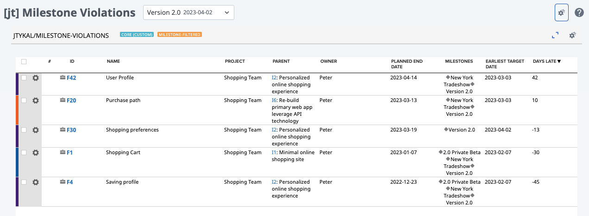

Milestone Violations
=========================

## Overview

Lists Features with Planned End Date relative to Milestone Target Date. A number >0 in the "Days Late" column indicates a Feature's Planned End Date comes AFTER the Milestone Target Date. Features that are planned to be completed prior to the Milestone Target Date will be displayed and will show a number <0 in the "Days Late" column.

If the Feature is included in more than one Milestone, the EARLIEST Milestone Target Date will be used in the comparison.

The result set for this app can (optionally) be filtered by using a page-level Milestone filter. (Release and Iteration page filters are NOT supported.) In this case, the Target Date used in the comparison will be from the selected Milestone in the page-level filter, even if another Milestone containing the Feature has an earlier Target Date.

See [Rally App Builder Documentation](https://help.rallydev.com/apps/2.0rc3/doc/#!/guide/app_builder) for additional instructions to create and deploy your own apps.

## License

AppTemplate is released under the MIT license.  See the file [LICENSE](./LICENSE) for the full text.

##Documentation for SDK

You can find the documentation on our help [site.](https://help.rallydev.com/apps/2.0/doc/)
